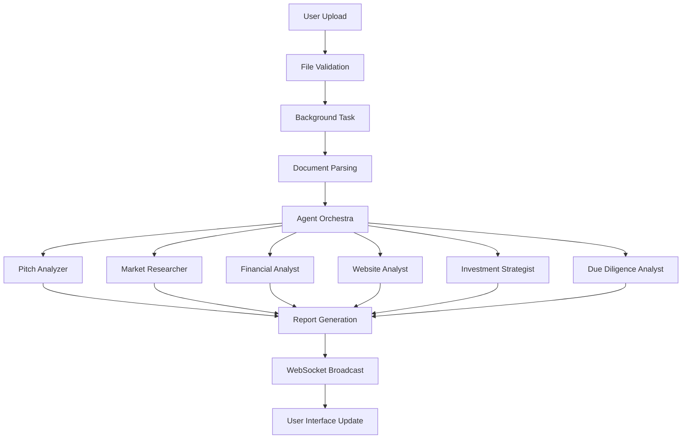

# 📊 Pitch Deck Analyzer

<div align="center">
  
  
  
  
</div>

<p align="center">
  <strong>🚀 A sophisticated AI-powered platform for comprehensive startup pitch deck analysis</strong>
</p>

<p align="center">
  Transform your investment decision-making with multi-agent AI analysis that provides deep insights into startup potential, market opportunities, and investment risks.
</p>

---

## 🎯 Overview

The **Pitch Deck Analyzer** is an enterprise-grade web application that leverages the power of **crewAI's multi-agent architecture** combined with **FastAPI** to provide comprehensive startup pitch deck analysis. Built for investors, VCs, accelerators, and startup analysts, this tool automates the due diligence process and provides structured, actionable insights.

### 🏆 Key Value Propositions

- **🤖 AI-Powered Analysis**: Six specialized AI agents work collaboratively to analyze different aspects of your pitch deck
- **⚡ Real-Time Processing**: WebSocket-based live updates with detailed progress tracking
- **📈 Comprehensive Reports**: Generate detailed investment reports with scoring, risk analysis, and recommendations
- **🎨 Modern Interface**: Beautiful, responsive UI with drag-and-drop functionality
- **🔧 Highly Configurable**: Customizable agents, tasks, and analysis parameters

---

## ✨ Features & Capabilities

### 🖥️ **Modern Web Interface**
- **Responsive Design**: Built with Tailwind CSS for mobile and desktop compatibility
- **Drag & Drop Upload**: Intuitive file upload with visual feedback
- **Real-Time Progress**: Live progress bars, status updates, and elapsed time tracking
- **Interactive Visualization**: Dynamic progress logging with agent activity monitoring
- **Toast Notifications**: User-friendly alerts and status messages
- **Download Reports**: One-click report download in markdown format

### 📄 **Document Processing & Analysis**
- **Multi-Format Support**: 
  - PDF documents (`.pdf`)
  - PowerPoint presentations (`.ppt`, `.pptx`)
  - Word documents (`.doc`, `.docx`)
- **Intelligent Text Extraction**: Advanced parsing with error handling
- **Content Analysis**: Smart content categorization and structure recognition
- **Validation**: File format validation and integrity checks

### 🤖 **Multi-Agent AI Architecture**

#### **1. 📊 Pitch Analyzer Agent**
- **Role**: Expert Pitch Deck Analyst with VC experience
- **Capabilities**:
  - Presentation clarity scoring (1-10)
  - Investor readiness assessment
  - Team capability evaluation
  - Market timing analysis
  - Execution capability scoring
  - Overall fundability rating with emojis (🟢🟡🔴)

#### **2. 🔍 Market Researcher Agent**
- **Role**: Market Research Specialist with India-focused expertise
- **Capabilities**:
  - TAM/SAM/SOM market sizing
  - Competitive landscape analysis
  - Market trends identification
  - Government policy analysis
  - Recent deal activity tracking

#### **3. 💰 Financial Analyst Agent**
- **Role**: Startup Economics & Unit Economics Specialist
- **Capabilities**:
  - Revenue model analysis
  - Unit economics evaluation (CAC, LTV, payback)
  - Financial projections assessment
  - Burn rate and runway analysis
  - Valuation multiples comparison

#### **4. 🌐 Website & Social Media Analyst**
- **Role**: Digital Presence Expert
- **Capabilities**:
  - Website design and UX audit
  - Social media engagement analysis
  - Online reputation assessment
  - SEO and digital marketing evaluation

#### **5. 🎯 Investment Strategist Agent**
- **Role**: Investment Strategy Specialist
- **Capabilities**:
  - Investment thesis alignment
  - Fundraising probability assessment
  - Strategic recommendations
  - Exit path analysis

#### **6. 🛡️ Due Diligence Analyst**
- **Role**: Risk Assessment Specialist
- **Capabilities**:
  - Execution risk identification
  - Financial risk analysis
  - Market risk evaluation
  - Regulatory compliance assessment

### 📡 **Real-Time Communication**
- **WebSocket Integration**: Live bidirectional communication
- **Progress Tracking**: Granular task progress with percentage completion
- **Agent Activity Logs**: Detailed logging of each agent's work
- **Error Handling**: Graceful error recovery and user notification
- **Session Management**: Unique job IDs for concurrent analysis sessions

---

## 🚀 Quick Start Guide

### Prerequisites

- **Python**: Version 3.10, 3.11, or 3.12 (3.13+ not yet supported)
- **OpenAI API Key**: Required for AI agent functionality
- **Git**: For cloning the repository

### 🔧 Installation

#### 1. **Clone the Repository**
```bash
git clone <your-repo-url>
cd pitch
```

#### 2. **Set Up Python Virtual Environment**
```bash
# Create virtual environment
python -m venv .venv

# Activate virtual environment
# On Linux/macOS:
source .venv/bin/activate

# On Windows:
.venv\Scripts\activate
```

#### 3. **Install Dependencies**
We use `uv` for fast package management:
```bash
# Install uv (if not already installed)
pip install uv

# Install project dependencies
uv pip install -e .
```

#### 4. **Environment Configuration**
Create a `.env` file in the project root:
```bash
# Copy the example environment file
cp .env.example .env  # If available

# Or create manually
touch .env
```

Add your configuration to `.env`:
```env
# Required: OpenAI API Configuration
OPENAI_API_KEY=your_openai_api_key_here
OPENAI_MODEL=gpt-4-turbo-preview

# Optional: Advanced Configuration
SERPER_API_KEY=your_serper_api_key_for_web_search
MAX_FILE_SIZE_MB=50
UPLOAD_DIR=uploads
LOG_LEVEL=INFO

# Optional: Database Configuration (if using persistent storage)
DATABASE_URL=sqlite:///./pitch_analyzer.db
```

#### 5. **Verify Installation**
```bash
# Test the installation
python -m pitch.main --help

# Or test with pytest (if tests are available)
pytest tests/ -v
```

### ⚡ Running the Application

#### **Method 1: Using the Project Script**
```bash
# Start the web server
pitch serve

# Or use the alternative command
serve
```

#### **Method 2: Direct Uvicorn Command**
```bash
# Development mode with auto-reload
uvicorn pitch.api:app --reload --host 0.0.0.0 --port 8000

# Production mode
uvicorn pitch.api:app --host 0.0.0.0 --port 8000 --workers 4
```

#### **Method 3: Using Docker (if Dockerfile available)**
```bash
# Build the Docker image
docker build -t pitch-analyzer .

# Run the container
docker run -p 8000:8000 --env-file .env pitch-analyzer
```

### 🌐 Accessing the Application

1. **Open your browser** and navigate to: `http://localhost:8000`
2. **Upload your pitch deck** (PDF, PPT, or PPTX format)
3. **Enter the startup name** for analysis
4. **Monitor real-time progress** as AI agents analyze the document
5. **Download the comprehensive report** once analysis is complete

---

## 📊 Analysis Output & Reports

### 📋 **Report Structure**

The generated analysis report includes the following sections:

#### **1. 📁 Pitch Deck Analysis Report**
- **Executive Summary**: High-level overview with aggregate scoring
- **Detailed Scoring & Investor Commentary**: Comprehensive 12-category analysis
- **Competitive Benchmarking**: Market position and competitor comparison
- **Risk Identification**: Execution, financial, and market risks
- **Investment Thesis Alignment**: Strategic fit assessment
- **Fundraising Probability**: 6-month fundraising likelihood
- **Actionable Recommendations**: Specific improvement suggestions
- **Exit Path Analysis**: M&A and IPO prospects
- **Website & Social Audit**: Digital presence evaluation

#### **2. 📑 Market Research Report**
- **Market Overview**: TAM/SAM/SOM analysis for India
- **Key Market Trends**: Industry dynamics and growth drivers
- **Key Players Comparison**: Competitive landscape with funding data
- **Valuation Multiples**: Industry benchmarks and comparable valuations
- **India-Specific Insights**: Cultural and regional market factors
- **Government Policies**: Regulatory environment and policy impact
- **Market Risks**: Industry-specific challenges and threats
- **Recent Deal Activity**: Latest funding rounds and M&A activity
- **Strategic Implications**: Investment recommendations and positioning

### 🎯 **Scoring System**

Each analysis category uses a standardized 1-10 scoring system with visual indicators:

- **🟢 8-10**: Good - Strong performance, minimal concerns
- **🟡 5-7**: Needs Improvement - Moderate concerns, action required
- **🔴 1-4**: Critical Risk - Significant issues, major red flags

### 📈 **Sector Heat Ratings**

- **🔥 Hot/Priority**: High-growth sector with strong investor interest
- **🌤️ Warm/Watchlist**: Moderate interest, good potential
- **❄️ Cold/Pass**: Limited interest, challenging market conditions

### 💼 **Investment Verdicts**

- **✅ Recommend**: Strong investment opportunity
- **🔍 Further Validation Needed**: Promising but requires additional due diligence
- **❌ Pass**: Not recommended for investment

---

## 🏗️ Architecture & Project Structure

### 📁 **Detailed Project Structure**

```
📦 pitch/
├── 📄 pyproject.toml              # Project configuration and dependencies
├── 📄 README.md                   # This comprehensive documentation
├── 📄 uv.lock                     # Dependency lock file
├── 📄 monitor.py                  # WebSocket monitoring utility
├── 📄 report.md                   # Sample generated report
├── 📄 required_format.md          # Template for report formatting
├── 📄 sample.pdf                  # Sample pitch deck for testing
├── 📂 src/pitch/                  # Main application package
│   ├── 📄 __init__.py            # Package initialization
│   ├── 📄 main.py                # CLI entry points and server startup
│   ├── 📄 api.py                 # FastAPI application and REST endpoints
│   ├── 📄 crew.py                # CrewAI agents and task orchestration
│   ├── 📄 status_manager.py      # WebSocket status management
│   ├── 📂 config/                # Configuration files
│   │   ├── 📄 agents.yaml        # AI agent definitions and behaviors
│   │   └── 📄 tasks.yaml         # Task descriptions and expected outputs
│   ├── 📂 static/                # Frontend web interface
│   │   ├── 📄 index.html         # Main web page
│   │   ├── 📄 script.js          # JavaScript for interactivity
│   │   └── 📄 styles.css         # Custom CSS styles
│   └── 📂 tools/                 # Custom AI agent tools
│       ├── 📄 __init__.py        # Tools package initialization
│       ├── 📄 document_tools.py  # PDF/PPT parsing and text extraction
│       ├── 📄 knowledge_base.py  # Vector store for knowledge retrieval
│       ├── 📄 serper_tool.py     # Web search and research capabilities
│       └── 📄 custom_tool.py     # Additional custom tools
├── 📂 knowledge/                  # Knowledge base and reference materials
│   └── 📄 user_preference.txt    # User preferences and settings
├── 📂 tests/                      # Test suite (unit and integration tests)
├── 📂 uploads/                    # Temporary file storage for uploads
└── 📂 __pycache__/               # Python bytecode cache
```

### 🔧 **Core Components**

#### **1. API Layer (`api.py`)**
- **FastAPI Application**: RESTful API with automatic documentation
- **File Upload Handling**: Multi-file upload with validation
- **WebSocket Manager**: Real-time communication for progress updates
- **Background Tasks**: Asynchronous processing of analysis jobs
- **Error Handling**: Comprehensive error management and user feedback

#### **2. AI Agent Orchestra (`crew.py`)**
- **Agent Definitions**: Six specialized AI agents with distinct roles
- **Task Coordination**: Sequential task execution with context sharing
- **Status Callbacks**: Real-time progress reporting to WebSocket clients
- **Output Management**: Structured report generation and formatting

#### **3. Status Management (`status_manager.py`)**
- **WebSocket Broadcasting**: Multi-client real-time updates
- **Job Tracking**: Unique job ID management for concurrent sessions
- **Progress Logging**: Detailed activity logs for debugging and monitoring
- **Connection Management**: Automatic cleanup of dead connections

#### **4. Document Processing Tools (`tools/`)**
- **PDF Parser**: Robust PDF text extraction with error handling
- **PowerPoint Parser**: PPTX slide content extraction
- **Web Research**: Internet search capabilities for market research
- **Knowledge Base**: Vector store for retrieving relevant information

#### **5. Frontend Interface (`static/`)**
- **Modern UI**: Responsive design with Tailwind CSS
- **File Upload**: Drag-and-drop with progress indicators
- **Real-time Updates**: WebSocket integration for live progress
- **Report Display**: Formatted markdown rendering with download options

### 🔄 **Data Flow Architecture**



### 🔌 **API Endpoints**

#### **REST API Endpoints**

| Method | Endpoint | Description | Parameters |
|--------|----------|-------------|------------|
| `GET` | `/` | Main web interface | None |
| `POST` | `/analyze` | Start pitch deck analysis | `startup_name`, `files[]` |
| `GET` | `/static/{file_path}` | Serve static files | `file_path` |

#### **WebSocket Endpoints**

| Endpoint | Description | Events |
|----------|-------------|---------|
| `/ws/{job_id}` | Real-time progress updates | `task_started`, `task_completed`, `completed`, `error` |

### 📋 **Configuration Management**

#### **Agent Configuration (`config/agents.yaml`)**
```yaml
pitch_analyzer:
  role: Expert Pitch Deck Analyst with venture capital experience
  goal: Analyze pitch decks and provide comprehensive evaluation
  backstory: Seasoned analyst with years of VC experience
```

#### **Task Configuration (`config/tasks.yaml`)**
```yaml
pitch_analysis_task:
  description: Analyze documents and create Executive Summary
  expected_output: Formatted analysis following template
  agent: pitch_analyzer
```

#### **Environment Variables**
```env
# Core Configuration
OPENAI_API_KEY=required_for_ai_functionality
OPENAI_MODEL=gpt-4-turbo-preview

# Optional Configuration  
SERPER_API_KEY=for_web_search_capabilities
MAX_FILE_SIZE_MB=50
UPLOAD_DIR=uploads
LOG_LEVEL=INFO
```

---

## ⚙️ Advanced Configuration & Customization

### 🎛️ **Agent Customization**

#### **Modifying Agent Behavior**
Edit `src/pitch/config/agents.yaml` to customize agent personalities and capabilities:

```yaml
# Example: Enhance the Market Researcher Agent
market_researcher:
  role: >
    Senior Market Research Specialist with 15+ years experience in Indian markets
  goal: >
    Conduct deep-dive market analysis with focus on regulatory environment and 
    competitive dynamics specific to Indian startup ecosystem
  backstory: >
    You've analyzed hundreds of Indian startups and have intimate knowledge of
    regulatory challenges, cultural factors, and market dynamics across sectors.
```

#### **Adding New Agents**
1. Define the agent in `agents.yaml`
2. Create the agent method in `crew.py`:
```python
@agent
def your_new_agent(self) -> Agent:
    return Agent(
        config=self.agents_config['your_new_agent'],
        llm=self.llm,
        verbose=True,
        tools=[YourCustomTool()]
    )
```

### 📝 **Task Configuration**

#### **Modifying Analysis Tasks**
Edit `src/pitch/config/tasks.yaml` to customize analysis depth and focus:

```yaml
# Example: Enhanced Financial Analysis
financial_analysis_task:
  description: >
    Perform comprehensive financial analysis including:
    - Revenue model sustainability analysis
    - Unit economics deep-dive with sensitivity analysis
    - Cash flow projections with scenario planning
    - Competitive pricing analysis
    - Funding requirement optimization
  expected_output: >
    Detailed financial analysis with interactive charts and sensitivity tables
```

#### **Adding Custom Tasks**
1. Define the task in `tasks.yaml`
2. Create the task method in `crew.py`:
```python
@task
def your_custom_task(self) -> Task:
    return Task(
        config=self.tasks_config['your_custom_task'],
        context_format=True
    )
```

### 🛠️ **Custom Tools Development**

#### **Creating New Tools**
Create custom tools in `src/pitch/tools/`:

```python
# Example: Social Media Analytics Tool
from crewai.tools import BaseTool
from pydantic import BaseModel, Field

class SocialMediaAnalytics(BaseTool):
    name: str = "Social Media Analytics"
    description: str = "Analyze social media presence and engagement"
    
    def _run(self, company_name: str) -> str:
        # Your custom logic here
        return f"Social media analysis for {company_name}"
```

#### **Available Built-in Tools**
- **DocumentParserTool**: PDF/PPT text extraction
- **WebResearchTool**: Internet search and research
- **KnowledgeBaseTool**: Vector-based knowledge retrieval

### 🎨 **Frontend Customization**

#### **UI Themes and Styling**
Modify `src/pitch/static/styles.css` for custom branding:

```css
/* Custom color scheme */
:root {
    --primary-color: #your-brand-color;
    --secondary-color: #your-secondary-color;
    --accent-color: #your-accent-color;
}

/* Custom animations */
.custom-animation {
    animation: yourCustomAnimation 2s ease-in-out;
}
```

#### **Adding New Features**
Extend `src/pitch/static/script.js` for additional functionality:

```javascript
// Example: Custom progress indicators
function customProgressHandler(progress) {
    // Your custom progress visualization
    updateCustomCharts(progress);
}
```

### 📊 **Analytics and Monitoring**

#### **Custom Logging**
Configure logging in your application:

```python
import logging

# Custom logging configuration
logging.basicConfig(
    level=logging.INFO,
    format='%(asctime)s - %(name)s - %(levelname)s - %(message)s',
    handlers=[
        logging.FileHandler('pitch_analyzer.log'),
        logging.StreamHandler()
    ]
)
```

#### **Performance Monitoring**
Add performance tracking:

```python
import time
from functools import wraps

def monitor_performance(func):
    @wraps(func)
    def wrapper(*args, **kwargs):
        start_time = time.time()
        result = func(*args, **kwargs)
        end_time = time.time()
        print(f"{func.__name__} took {end_time - start_time:.2f} seconds")
        return result
    return wrapper
```

---

## 🐛 Troubleshooting & FAQ

### 🔧 **Common Issues**

#### **Issue: OpenAI API Key Not Working**
```bash
# Check if your API key is set correctly
echo $OPENAI_API_KEY

# Test API key with curl
curl https://api.openai.com/v1/models \
  -H "Authorization: Bearer $OPENAI_API_KEY"
```

**Solution**: Ensure your API key is valid and has sufficient credits.

#### **Issue: File Upload Fails**
```bash
# Check file permissions
ls -la uploads/

# Check disk space
df -h
```

**Solutions**:
- Ensure `uploads/` directory exists and is writable
- Check file size limits in configuration
- Verify supported file formats (PDF, PPT, PPTX)

#### **Issue: WebSocket Connection Fails**
**Solutions**:
- Check firewall settings for port 8000
- Ensure no other services are using the port
- Try a different port: `uvicorn pitch.api:app --port 8001`

#### **Issue: Agent Tasks Timeout**
**Solutions**:
- Increase timeout values in agent configuration
- Check OpenAI API rate limits
- Monitor network connectivity

### ❓ **Frequently Asked Questions**

#### **Q: Can I use different LLM models?**
A: Yes! Modify the model in `crew.py`:
```python
self.llm = ChatOpenAI(
    model_name="gpt-3.5-turbo",  # or "gpt-4", "claude-3"
    temperature=0.7,
)
```

#### **Q: How do I add support for new file formats?**
A: Extend the `DocumentParserTool` in `src/pitch/tools/document_tools.py`:
```python
def _parse_docx(self, file_path: str) -> str:
    # Add DOCX parsing logic
    pass
```

#### **Q: Can I run this in production?**
A: Yes! Use production settings:
```bash
uvicorn pitch.api:app --host 0.0.0.0 --port 8000 --workers 4
```

#### **Q: How do I backup analysis results?**
A: Implement database storage or file persistence:
```python
# Example: Save to database
def save_analysis_result(job_id: str, result: str):
    # Your database logic here
    pass
```

#### **Q: Can I integrate with other platforms?**
A: Yes! Add webhook endpoints or API integrations:
```python
@app.post("/webhook/slack")
async def slack_webhook(data: dict):
    # Send results to Slack
    pass
```

### 📈 **Performance Optimization**

#### **Scaling for High Volume**
- Use Redis for session management
- Implement database connection pooling
- Add caching layers for repeated analyses
- Use container orchestration (Kubernetes)

#### **Memory Optimization**
```python
# Example: Memory-efficient file processing
def process_large_files_in_chunks(file_path: str, chunk_size: int = 1024):
    with open(file_path, 'rb') as file:
        while chunk := file.read(chunk_size):
            yield chunk
```

---

## 📚 Development Guide

### 🧪 **Testing**

#### **Running Tests**
```bash
# Run all tests
pytest tests/ -v

# Run specific test categories
pytest tests/unit/ -v
pytest tests/integration/ -v

# Run with coverage
pytest --cov=pitch tests/
```

#### **Writing New Tests**
```python
# Example test file: tests/test_agents.py
import pytest
from pitch.crew import Pitch

def test_pitch_analyzer_agent():
    crew = Pitch()
    agent = crew.pitch_analyzer()
    assert agent.role == "Expert Pitch Deck Analyst"

def test_document_parsing():
    # Test document parsing functionality
    pass
```

### 🔄 **CI/CD Pipeline**

#### **GitHub Actions Example**
```yaml
# .github/workflows/ci.yml
name: CI/CD Pipeline

on: [push, pull_request]

jobs:
  test:
    runs-on: ubuntu-latest
    steps:
      - uses: actions/checkout@v2
      - uses: actions/setup-python@v2
        with:
          python-version: '3.11'
      - run: pip install uv
      - run: uv pip install -e .
      - run: pytest tests/
```

### 📦 **Building and Deployment**

#### **Docker Deployment**
```dockerfile
# Dockerfile
FROM python:3.11-slim

WORKDIR /app
COPY . .

RUN pip install uv
RUN uv pip install -e .

EXPOSE 8000
CMD ["uvicorn", "pitch.api:app", "--host", "0.0.0.0", "--port", "8000"]
```

#### **Kubernetes Deployment**
```yaml
# k8s-deployment.yaml
apiVersion: apps/v1
kind: Deployment
metadata:
  name: pitch-analyzer
spec:
  replicas: 3
  selector:
    matchLabels:
      app: pitch-analyzer
  template:
    metadata:
      labels:
        app: pitch-analyzer
    spec:
      containers:
      - name: pitch-analyzer
        image: your-registry/pitch-analyzer:latest
        ports:
        - containerPort: 8000
```

---

## 🤝 Contributing & Community

### 🌟 **How to Contribute**

We welcome contributions from the community! Here's how you can help improve the Pitch Deck Analyzer:

#### **Types of Contributions**
- 🐛 **Bug Reports**: Help us identify and fix issues
- ✨ **Feature Requests**: Suggest new capabilities and improvements
- 📖 **Documentation**: Improve guides, tutorials, and API docs
- 🧪 **Testing**: Add test cases and improve test coverage
- 🔧 **Code Contributions**: Submit bug fixes and new features

#### **Getting Started**
1. **Fork the repository** on GitHub
2. **Clone your fork** locally:
   ```bash
   git clone https://github.com/your-username/pitch-analyzer.git
   cd pitch-analyzer
   ```
3. **Create a feature branch**:
   ```bash
   git checkout -b feature/your-amazing-feature
   ```
4. **Make your changes** and commit:
   ```bash
   git commit -m "Add your amazing feature"
   ```
5. **Push to your fork**:
   ```bash
   git push origin feature/your-amazing-feature
   ```
6. **Create a Pull Request** on GitHub

#### **Development Setup**
```bash
# Install development dependencies
uv pip install -e ".[dev]"

# Install pre-commit hooks
pre-commit install

# Run tests before committing
pytest tests/ -v

# Check code formatting
black src/
isort src/
flake8 src/
```

#### **Code Style Guidelines**
- Follow **PEP 8** Python style guidelines
- Use **Black** for code formatting
- Add **type hints** for function parameters and returns
- Write **comprehensive docstrings** for all functions and classes
- Maintain **test coverage** above 80%

#### **Pull Request Guidelines**
- ✅ Ensure all tests pass
- ✅ Add tests for new functionality
- ✅ Update documentation as needed
- ✅ Follow the commit message format
- ✅ Keep PRs focused and atomic

### 🏆 **Recognition**

Contributors will be recognized in our:
- 📋 **Contributors List** in the README
- 🎖️ **GitHub Contributors** section
- 📢 **Release Notes** for significant contributions

---

## 📄 License & Legal

### 📜 **License**
This project is licensed under the **MIT License**. See the [LICENSE](LICENSE) file for full details.

```
MIT License

Copyright (c) 2024 Pitch Deck Analyzer Contributors

Permission is hereby granted, free of charge, to any person obtaining a copy
of this software and associated documentation files (the "Software"), to deal
in the Software without restriction, including without limitation the rights
to use, copy, modify, merge, publish, distribute, sublicense, and/or sell
copies of the Software, and to permit persons to whom the Software is
furnished to do so, subject to the following conditions:

The above copyright notice and this permission notice shall be included in all
copies or substantial portions of the Software.
```

### ⚖️ **Third-Party Licenses**
This project uses several open-source libraries:
- **FastAPI**: MIT License
- **CrewAI**: MIT License  
- **OpenAI Python**: MIT License
- **Tailwind CSS**: MIT License

### 🔒 **Data Privacy & Security**
- 📄 **Document Processing**: Files are processed locally and deleted after analysis
- 🔐 **API Keys**: Stored securely in environment variables
- 🗑️ **Data Retention**: No persistent storage of uploaded documents
- 🛡️ **Security**: Regular dependency updates and security scanning

---

## 📞 Support & Resources

### 🆘 **Getting Help**

#### **Documentation**
- 📖 **API Documentation**: Available at `/docs` when running the server
- 🔧 **Configuration Guide**: See the configuration section above
- 🎯 **Best Practices**: Check our wiki for optimization tips

#### **Community Support**
- 💬 **GitHub Discussions**: Ask questions and share ideas
- 🐛 **Issue Tracker**: Report bugs and request features
- 📧 **Email Support**: contact@pitch-analyzer.com
- 💼 **Enterprise Support**: enterprise@pitch-analyzer.com

#### **Professional Services**
- 🎓 **Training Workshops**: Custom training for your team
- 🏗️ **Custom Implementation**: Tailored solutions for enterprise
- ☁️ **Cloud Deployment**: Managed hosting and scaling
- 🔧 **Integration Services**: Connect with your existing tools

### 🔗 **Useful Links**

#### **External Resources**
- 🤖 **CrewAI Documentation**: [https://docs.crewai.com](https://docs.crewai.com)
- ⚡ **FastAPI Documentation**: [https://fastapi.tiangolo.com](https://fastapi.tiangolo.com)
- 🧠 **OpenAI API**: [https://platform.openai.com/docs](https://platform.openai.com/docs)
- 🎨 **Tailwind CSS**: [https://tailwindcss.com](https://tailwindcss.com)

#### **Related Projects**
- 📊 **Startup Analytics Tools**: Similar analysis platforms
- 🤖 **AI Agent Frameworks**: Alternative multi-agent systems
- 📄 **Document Processing**: PDF and presentation parsers

### 📋 **Changelog**

#### **Version 1.0.0** (Current)
- ✨ Initial release with six AI agents
- 🌐 Full web interface with real-time updates
- 📄 Support for PDF, PPT, and PPTX files
- 📊 Comprehensive analysis reports
- 🔌 WebSocket integration for live progress

#### **Upcoming Features**
- 🔄 **Batch Processing**: Analyze multiple pitch decks simultaneously
- 📱 **Mobile App**: Native iOS and Android applications
- 🌍 **Multi-language Support**: Analysis in multiple languages
- 🤖 **Custom AI Models**: Integration with custom fine-tuned models
- 📈 **Analytics Dashboard**: Historical analysis trends and insights

---

## 🚀 **Get Started Today!**

Ready to revolutionize your pitch deck analysis? 

1. **⬇️ Clone the repository**
2. **🔧 Follow the installation guide**
3. **🚀 Start analyzing pitch decks**
4. **📊 Get comprehensive insights**

<div align="center">
  <strong>🎯 Transform your investment decision-making with AI-powered analysis!</strong>
</div>

---

<div align="center">
  <p>Made with ❤️ by the Pitch Deck Analyzer team</p>
  <p>
    <a href="#-pitch-deck-analyzer">Back to Top ⬆️</a>
  </p>
</div>
